# RealWorld Conduit 앱 디자인 문서

> **바이브 코딩(Vibe Coding)** 기법과 **아르민 로나허의 개발 철학**을 적용한 RealWorld 앱 설계

## 📋 목차

1. [시스템 개요](#시스템-개요)
2. [아키텍처 설계](#아키텍처-설계)
3. [데이터베이스 설계](#데이터베이스-설계)
4. [API 설계](#api-설계)
5. [프론트엔드 설계](#프론트엔드-설계)
6. [보안 설계](#보안-설계)
7. [성능 고려사항](#성능-고려사항)
8. [배포 및 운영](#배포-및-운영)

## 🎯 시스템 개요

### 프로젝트 비전
- **목표**: Medium.com과 같은 소셜 블로깅 플랫폼의 MVP 구현
- **철학**: 바이브 코딩을 통한 직관적이고 실용적인 개발
- **원칙**: 의존성 최소화, 명시적 구현, AI 친화적 코드

### 핵심 기능
- 사용자 인증 및 프로필 관리
- 게시글 작성, 조회, 수정, 삭제
- 댓글 시스템
- 소셜 기능 (팔로우, 즐겨찾기)
- 태그 기반 분류

## 🏗 아키텍처 설계

### 전체 시스템 아키텍처

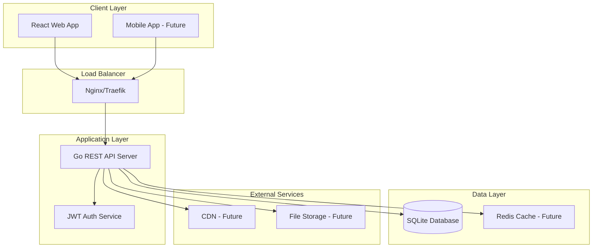

### 컨테이너 아키텍처

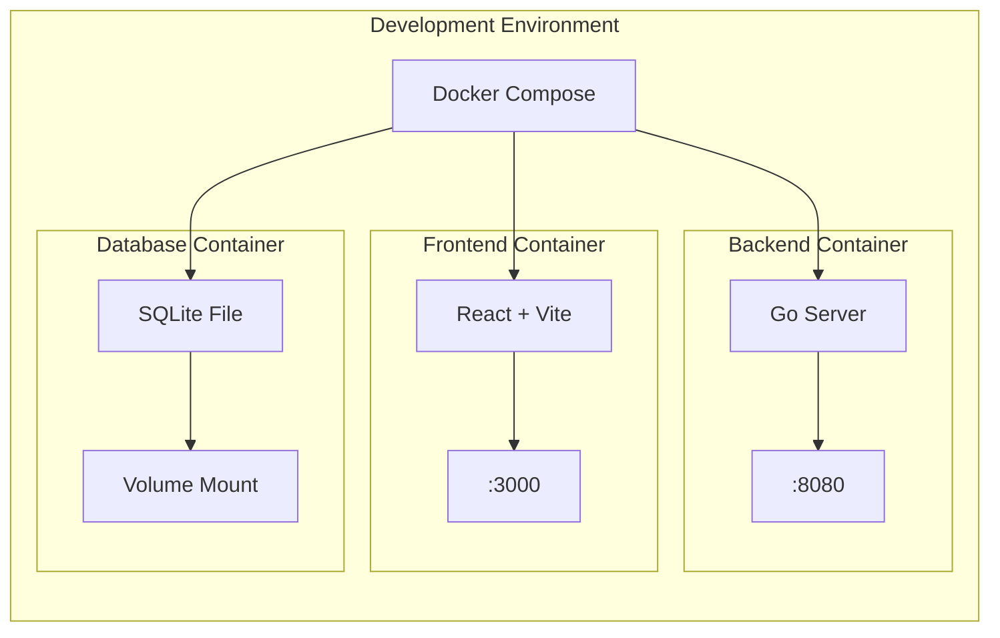

### 기술 스택 구조

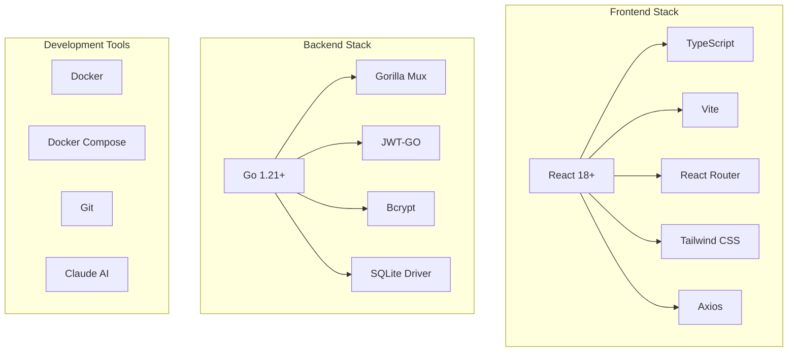

## 🗄 데이터베이스 설계

### ERD (Entity Relationship Diagram)

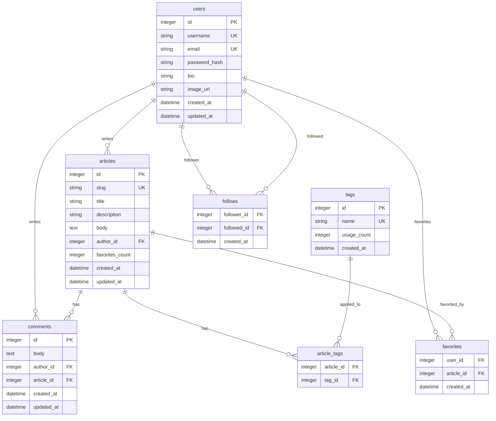

### 데이터베이스 스키마 (SQLite)

```sql
-- 사용자 테이블
CREATE TABLE users (
    id INTEGER PRIMARY KEY AUTOINCREMENT,
    username VARCHAR(100) UNIQUE NOT NULL,
    email VARCHAR(255) UNIQUE NOT NULL,
    password_hash VARCHAR(255) NOT NULL,
    bio TEXT,
    image_url VARCHAR(500),
    created_at DATETIME DEFAULT CURRENT_TIMESTAMP,
    updated_at DATETIME DEFAULT CURRENT_TIMESTAMP
);

-- 게시글 테이블
CREATE TABLE articles (
    id INTEGER PRIMARY KEY AUTOINCREMENT,
    slug VARCHAR(255) UNIQUE NOT NULL,
    title VARCHAR(500) NOT NULL,
    description TEXT,
    body TEXT NOT NULL,
    author_id INTEGER NOT NULL,
    favorites_count INTEGER DEFAULT 0,
    created_at DATETIME DEFAULT CURRENT_TIMESTAMP,
    updated_at DATETIME DEFAULT CURRENT_TIMESTAMP,
    FOREIGN KEY (author_id) REFERENCES users(id) ON DELETE CASCADE
);

-- 댓글 테이블
CREATE TABLE comments (
    id INTEGER PRIMARY KEY AUTOINCREMENT,
    body TEXT NOT NULL,
    author_id INTEGER NOT NULL,
    article_id INTEGER NOT NULL,
    created_at DATETIME DEFAULT CURRENT_TIMESTAMP,
    updated_at DATETIME DEFAULT CURRENT_TIMESTAMP,
    FOREIGN KEY (author_id) REFERENCES users(id) ON DELETE CASCADE,
    FOREIGN KEY (article_id) REFERENCES articles(id) ON DELETE CASCADE
);

-- 태그 테이블
CREATE TABLE tags (
    id INTEGER PRIMARY KEY AUTOINCREMENT,
    name VARCHAR(100) UNIQUE NOT NULL,
    usage_count INTEGER DEFAULT 0,
    created_at DATETIME DEFAULT CURRENT_TIMESTAMP
);

-- 게시글-태그 연결 테이블
CREATE TABLE article_tags (
    article_id INTEGER,
    tag_id INTEGER,
    PRIMARY KEY (article_id, tag_id),
    FOREIGN KEY (article_id) REFERENCES articles(id) ON DELETE CASCADE,
    FOREIGN KEY (tag_id) REFERENCES tags(id) ON DELETE CASCADE
);

-- 즐겨찾기 테이블
CREATE TABLE favorites (
    user_id INTEGER,
    article_id INTEGER,
    created_at DATETIME DEFAULT CURRENT_TIMESTAMP,
    PRIMARY KEY (user_id, article_id),
    FOREIGN KEY (user_id) REFERENCES users(id) ON DELETE CASCADE,
    FOREIGN KEY (article_id) REFERENCES articles(id) ON DELETE CASCADE
);

-- 팔로우 테이블
CREATE TABLE follows (
    follower_id INTEGER,
    followed_id INTEGER,
    created_at DATETIME DEFAULT CURRENT_TIMESTAMP,
    PRIMARY KEY (follower_id, followed_id),
    FOREIGN KEY (follower_id) REFERENCES users(id) ON DELETE CASCADE,
    FOREIGN KEY (followed_id) REFERENCES users(id) ON DELETE CASCADE,
    CHECK (follower_id != followed_id)
);

-- 인덱스 생성
CREATE INDEX idx_articles_author ON articles(author_id);
CREATE INDEX idx_articles_created_at ON articles(created_at DESC);
CREATE INDEX idx_comments_article ON comments(article_id);
CREATE INDEX idx_favorites_user ON favorites(user_id);
CREATE INDEX idx_follows_follower ON follows(follower_id);
CREATE INDEX idx_follows_followed ON follows(followed_id);
```

## 🔌 API 설계

### API 아키텍처

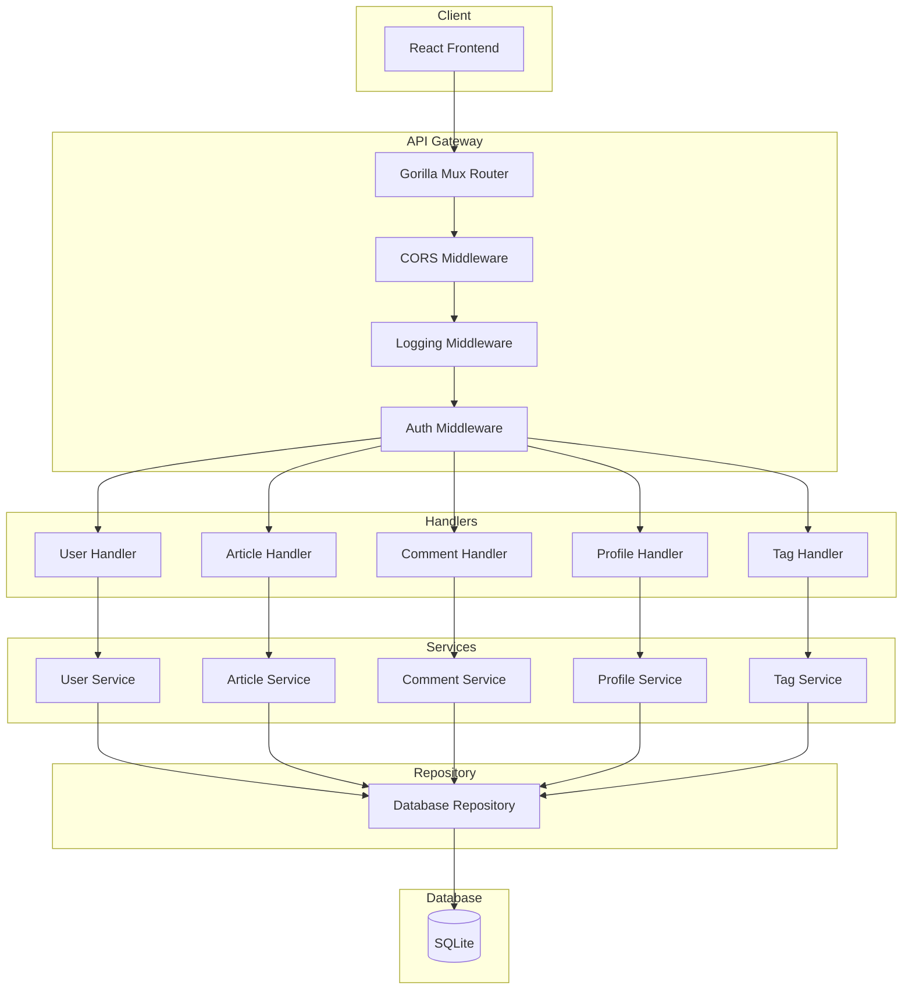

### API 엔드포인트 설계

#### 인증 관련 API
```yaml
POST /api/users:
  summary: 사용자 등록
  body: { user: { username, email, password } }
  response: { user: { email, token, username, bio, image } }

POST /api/users/login:
  summary: 사용자 로그인
  body: { user: { email, password } }
  response: { user: { email, token, username, bio, image } }

GET /api/user:
  summary: 현재 사용자 정보
  auth: required
  response: { user: { email, token, username, bio, image } }

PUT /api/user:
  summary: 사용자 정보 수정
  auth: required
  body: { user: { email, bio, image } }
  response: { user: { email, token, username, bio, image } }
```

#### 프로필 관련 API
```yaml
GET /api/profiles/:username:
  summary: 프로필 조회
  response: { profile: { username, bio, image, following } }

POST /api/profiles/:username/follow:
  summary: 사용자 팔로우
  auth: required
  response: { profile: { username, bio, image, following: true } }

DELETE /api/profiles/:username/follow:
  summary: 사용자 언팔로우
  auth: required
  response: { profile: { username, bio, image, following: false } }
```

#### 게시글 관련 API
```yaml
GET /api/articles:
  summary: 게시글 목록 조회
  params: { tag, author, favorited, limit, offset }
  response: { articles: [], articlesCount: number }

GET /api/articles/feed:
  summary: 팔로우 피드
  auth: required
  params: { limit, offset }
  response: { articles: [], articlesCount: number }

POST /api/articles:
  summary: 게시글 작성
  auth: required
  body: { article: { title, description, body, tagList } }
  response: { article: {...} }

GET /api/articles/:slug:
  summary: 게시글 상세 조회
  response: { article: {...} }

PUT /api/articles/:slug:
  summary: 게시글 수정
  auth: required (author only)
  body: { article: { title, description, body } }
  response: { article: {...} }

DELETE /api/articles/:slug:
  summary: 게시글 삭제
  auth: required (author only)
  response: {}
```

### API 응답 형식

```go
// 성공 응답
type SuccessResponse struct {
    Data interface{} `json:"data,omitempty"`
    User *User       `json:"user,omitempty"`
    Article *Article `json:"article,omitempty"`
    Articles []Article `json:"articles,omitempty"`
    ArticlesCount int `json:"articlesCount,omitempty"`
    Profile *Profile `json:"profile,omitempty"`
    Comment *Comment `json:"comment,omitempty"`
    Comments []Comment `json:"comments,omitempty"`
    Tags []string    `json:"tags,omitempty"`
}

// 에러 응답
type ErrorResponse struct {
    Errors map[string][]string `json:"errors"`
}
```

## 🎨 프론트엔드 설계

### 컴포넌트 구조

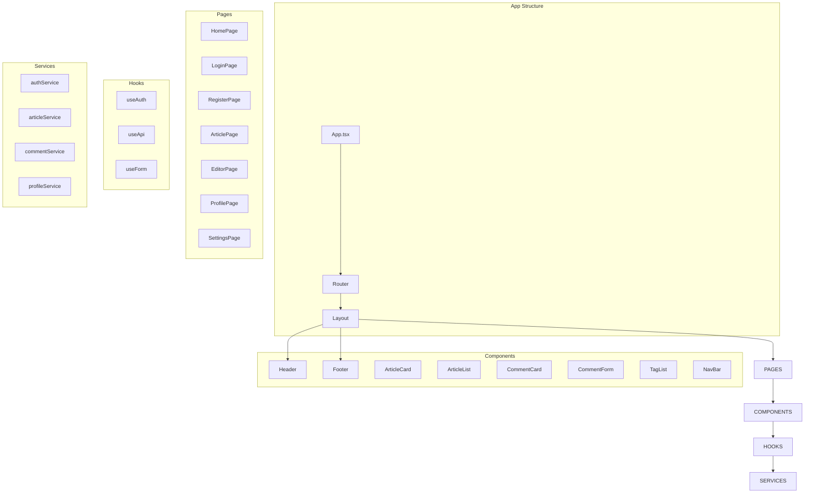

### 페이지별 컴포넌트 구조

#### 홈페이지 구조
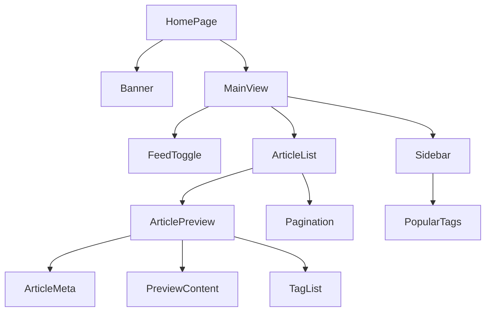

#### 게시글 상세 페이지 구조
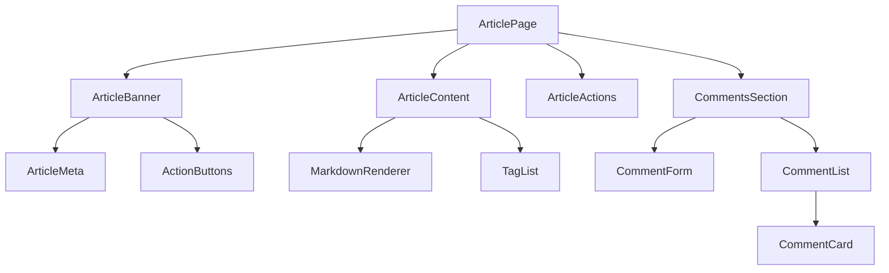

### 상태 관리 설계

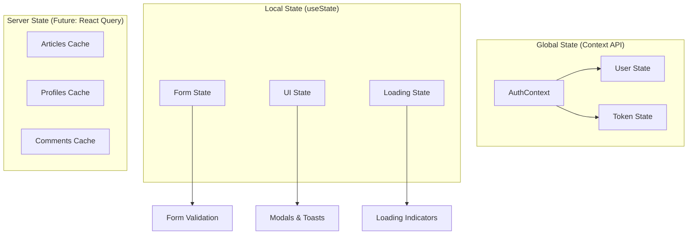

## 🔒 보안 설계

### 인증 플로우

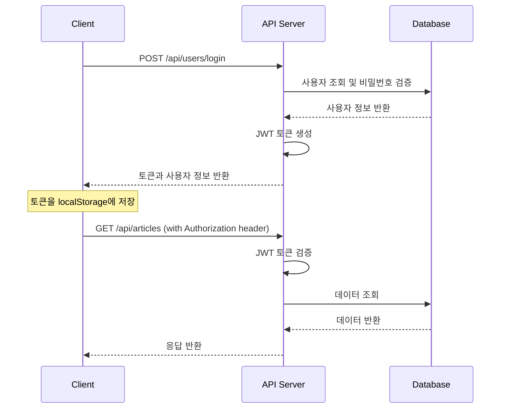

### 보안 고려사항

1. **JWT 토큰 보안**
   - 적절한 만료 시간 설정
   - 안전한 서명 알고리즘 (HS256)
   - 토큰 갱신 메커니즘

2. **비밀번호 보안**
   - bcrypt를 사용한 해싱
   - 적절한 라운드 수 설정 (12 rounds)

3. **입력 검증**
   - 모든 사용자 입력에 대한 검증
   - SQL 인젝션 방지
   - XSS 공격 방지

4. **CORS 설정**
   - 허용된 도메인만 API 접근 가능
   - 적절한 헤더 설정

## ⚡ 성능 고려사항

### 데이터베이스 최적화

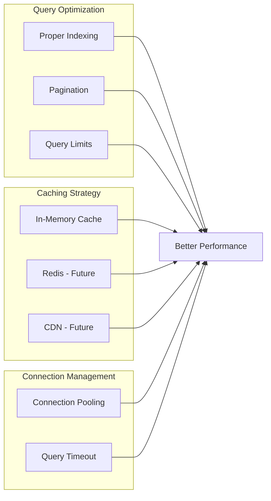

### 프론트엔드 최적화

1. **번들 최적화**
   - Code splitting
   - Tree shaking
   - Lazy loading

2. **렌더링 최적화**
   - React.memo 적용
   - useMemo/useCallback 활용
   - Virtual scrolling (긴 목록)

3. **네트워크 최적화**
   - API 요청 최소화
   - 중복 요청 방지
   - 적절한 캐싱 전략

## 🚀 배포 및 운영

### 배포 아키텍처

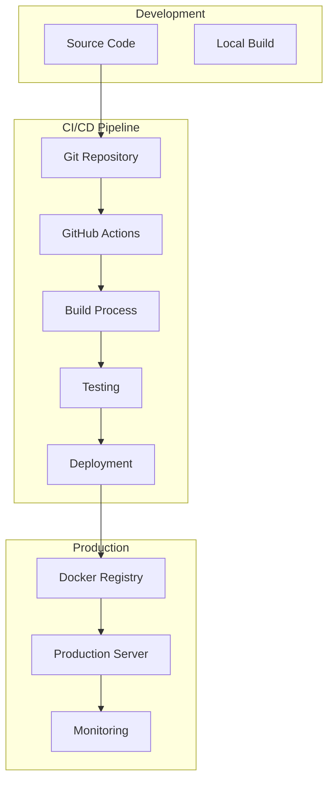

### Docker 컨테이너 설계

```dockerfile
# 백엔드 Dockerfile 예시
FROM golang:1.21-alpine AS builder
WORKDIR /app
COPY go.mod go.sum ./
RUN go mod download
COPY . .
RUN CGO_ENABLED=1 GOOS=linux go build -o main cmd/main.go

FROM alpine:latest
RUN apk --no-cache add ca-certificates sqlite
WORKDIR /root/
COPY --from=builder /app/main .
COPY --from=builder /app/migrations ./migrations
EXPOSE 8080
CMD ["./main"]
```

## 📊 모니터링 및 로깅

### 로깅 전략

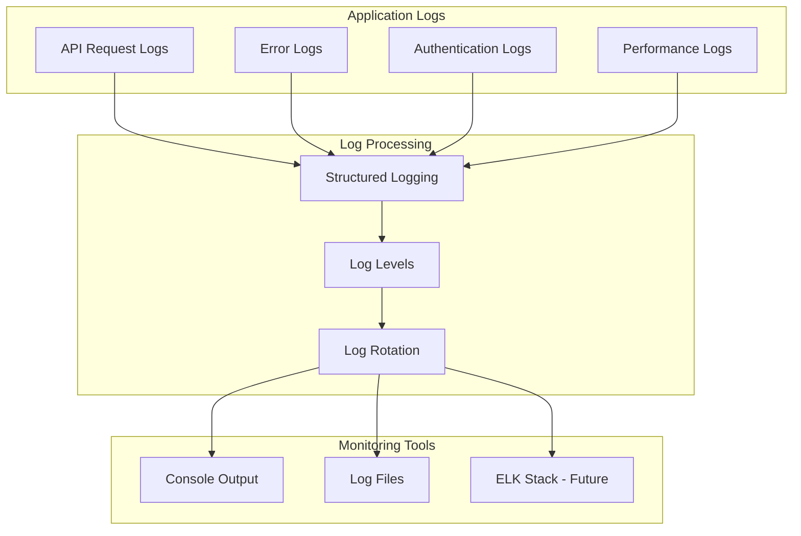

## 🔄 향후 확장 계획

### Phase 2 기능 추가
- 실시간 알림 시스템 (WebSocket)
- 이미지 업로드 기능
- 검색 기능 고도화
- 모바일 반응형 개선

### Phase 3 스케일링
- Redis 캐시 도입
- PostgreSQL 마이그레이션
- 마이크로서비스 아키텍처 전환
- 로드 밸런싱

---

## 📝 참고 문서

- [PRD.md](./PRD.md) - 제품 요구사항 문서
- [tasks.md](./tasks.md) - 개발 작업 목록
- [RealWorld 스펙](https://realworld-docs.netlify.app/) - 공식 스펙
- [아르민 로나허 블로그](https://lucumr.pocoo.org/) - 개발 철학 참고

> 💡 **참고**: 이 설계 문서는 바이브 코딩 원칙에 따라 필요에 따라 수정 및 확장될 수 있습니다.